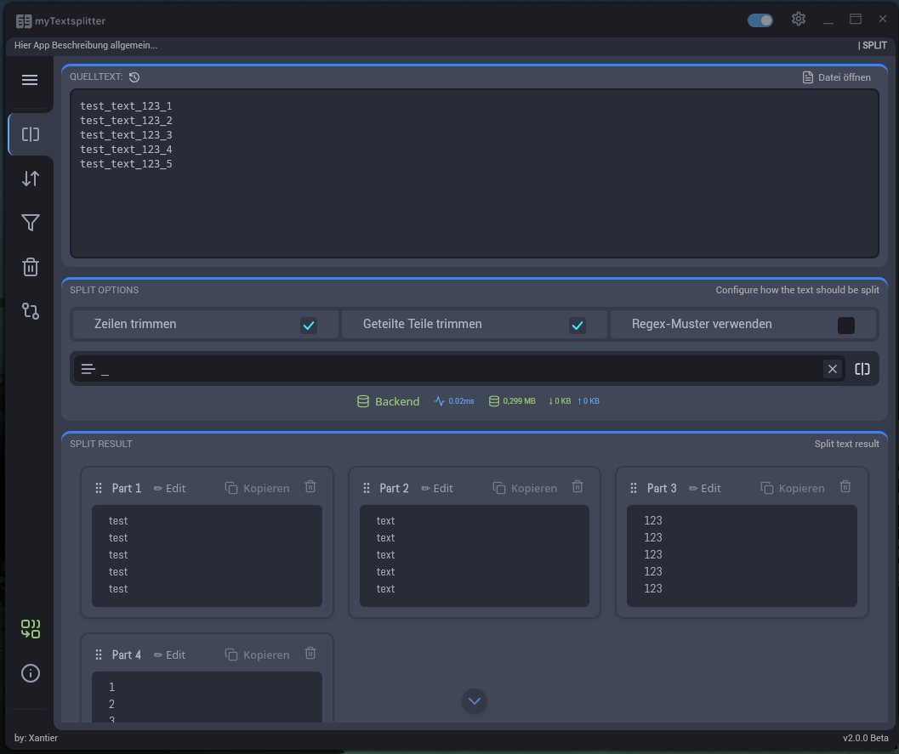
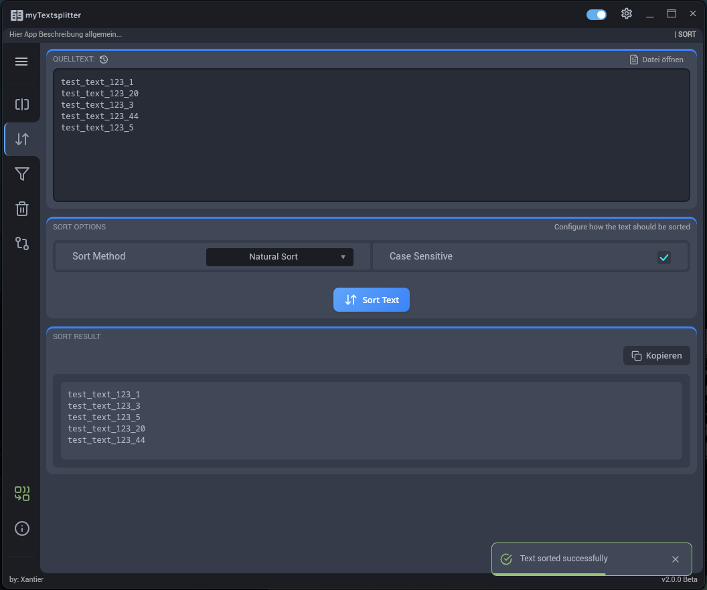
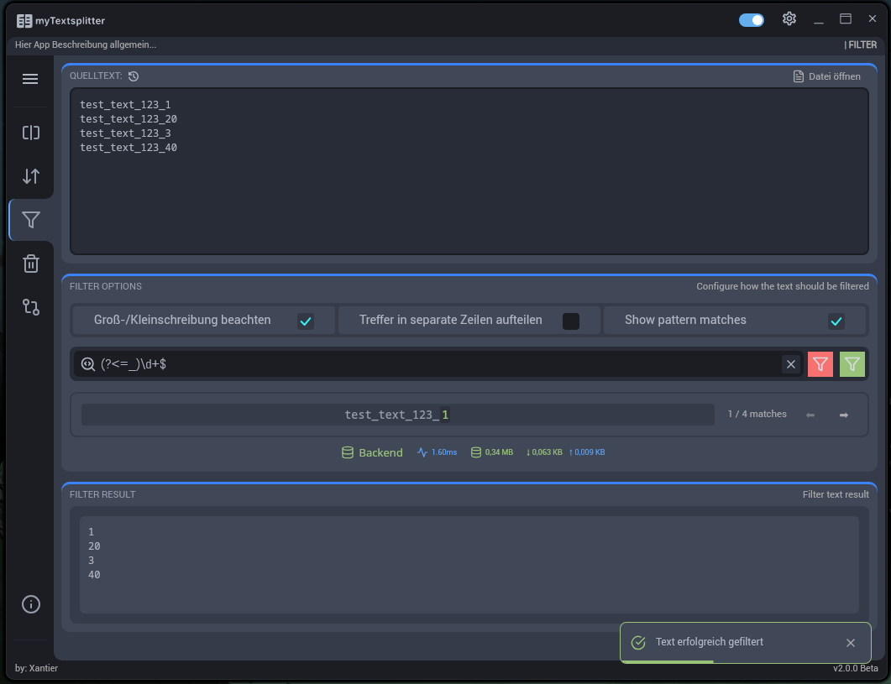
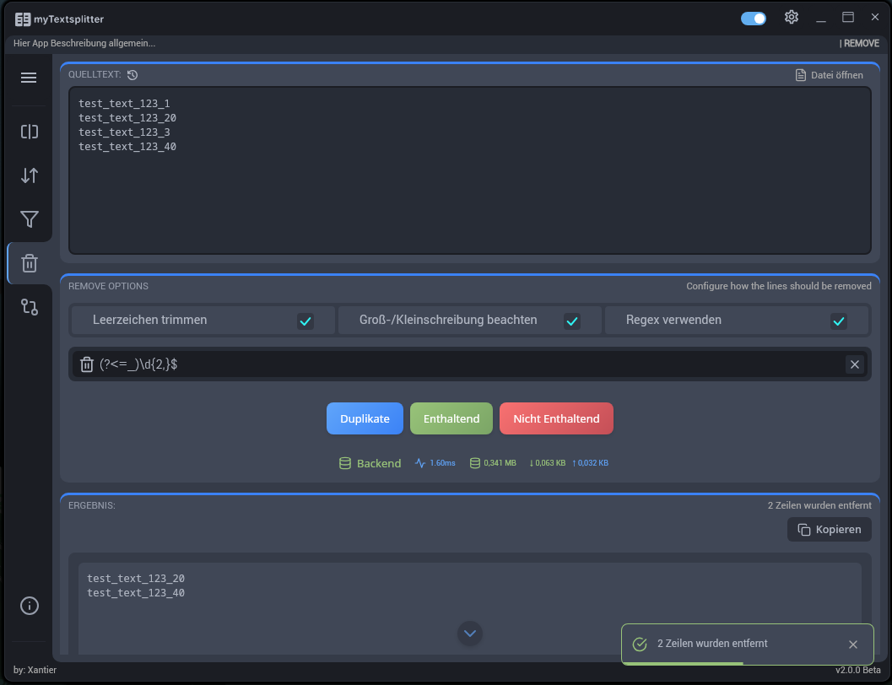

# 🛠️ myTextsplitter

**A powerful and intuitive desktop app for advanced text processing**, built with [Tauri](https://tauri.app/) and [React](https://reactjs.org/).
Perform operations like splitting, filtering, diffing, removing, and sorting text efficiently through a modern UI.

---

## ✨ Features

### 🔹 Text Splitting

Split text using:

* Custom delimiters or regex
* Trim options for lines and splits
* Multi-delimiter and regex support
* Auto-split on paste
* Combine columns with custom separators



### 🔹 Text Sorting

Organize your text:

* Alphabetical (A–Z / Z–A)
* Natural sorting (e.g. "file1", "file10", "file2")
* Length-based sorting
* Shuffle/random order
* Case sensitivity toggle



### 🔹 Text Filtering

Filter content with:

* Regex matching
* Keep/remove match logic
* Match preview in real-time
* Case sensitivity and match splitting



### 🔹 Line Removal

Remove lines based on:

* Duplicates
* Containing or not containing specific patterns
* Regex and case-sensitive matching



### 🔹 Text Diffing

Compare two blocks of text:

* Unified or side-by-side views
* Word-level highlighting
* Color-coded changes
* Line numbers and whitespace toggle

---

## 🚀 Getting Started

### ✅ Prerequisites

* [Node.js](https://nodejs.org/) (v16+)
* [Rust](https://www.rust-lang.org/tools/install) (stable)
* OS: Windows or Linux

### 🔧 Installation

```bash
git clone https://github.com/myXantier/myTextsplitter.git
cd myTextsplitter
npm install
```

### 🧪 Development

```bash
# Run in browser
npm run dev

# Run as Tauri app
npm run tauri dev
```

### 📆 Production Build

```bash
npm run build
npm run tauri build
```

The compiled app is found in `src-tauri/target/release`.

---

## 🖼️ Usage Examples

### 🔍 Splitting Text

1. Paste text into input
2. Choose delimiter (e.g. comma, tab, regex)
3. Configure split options
4. Click "Split Text"
5. View results in columns
6. Optionally combine with custom separators

---

## ⌨️ Keyboard Shortcuts

| Shortcut              | Action                      |
| --------------------- | --------------------------- |
| Ctrl+Enter            | Process text (split/filter) |
| Ctrl+S                | Save output                 |
| Ctrl+Z / Ctrl+Shift+Z | Undo / Redo                 |
| Ctrl+C                | Copy text                   |
| Ctrl+D                | Toggle dark/light theme     |

---

## ⚙️ Architecture

* **Frontend**: React, TypeScript, CSS
* **Backend**: Rust (via Tauri)
* **State**: Zustand
* **Performance**: JS + Rust workers for heavy tasks

---

## 🤝 Contributing

1. Fork this repo
2. Create branch: `git checkout -b feature/awesome-feature`
3. Commit: `git commit -m 'Add feature'`
4. Push: `git push origin feature/awesome-feature`
5. Create Pull Request

---

## ⚠️ Known Limitations

* Max recommended file size: **10MB**
* Complex regex may cause performance issues
* Web version has reduced functionality

---

## 📄 License

This project is under the [MIT License](./LICENSE).

---

## 🧑‍💻 Credits

* Developed by **Xantier**
* UI inspired by modern design principles
* Built with [Tauri](https://tauri.app/), [React](https://reactjs.org/), and [TypeScript](https://www.typescriptlang.org/)

---

## 💬 Support

Found a bug or have a question?
Open an issue

---
